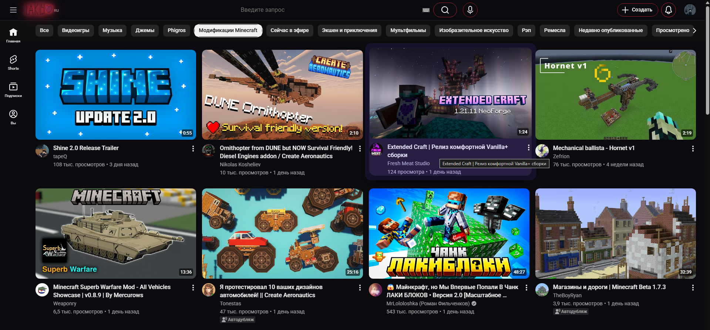
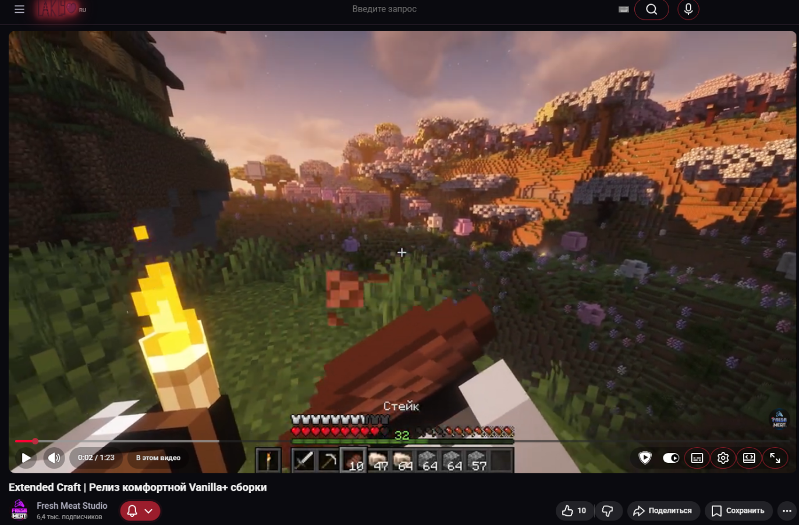
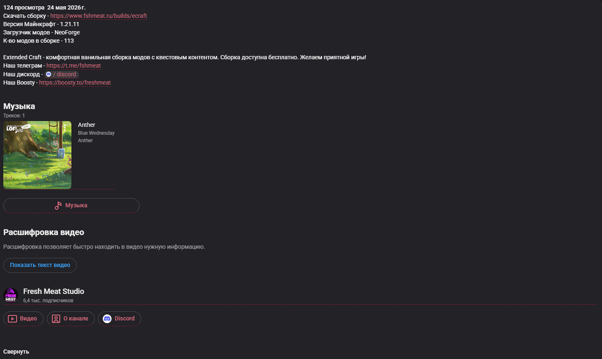

# LaklyTab 🎨

**Тёмные темы для расширения Stylus**

Добро пожаловать в **LaklyTab** — коллекция кастомных CSS-тем, созданных для тех, кто хочет полностью преобразить внешний вид популярных сайтов. Главная цель проекта — глубокая кастомизация, плавные анимации и атмосферный тёмный стиль с уникальными акцентами.

> Проект находится в активной разработке. Следите за обновлениями!

---

## ✨ Особенности

- 🎨 **Уникальное оформление**: тёмно-фиолетовый фон с бордовыми акцентами.
- 🖱️ **Плавные анимации**: эффекты при наведении, пульсация кнопок, «рябь» при клике, каскадное появление карточек.
- 🔍 **Минималистичный поиск**: прозрачное поле ввода с анимированной нижней линией.
- 🎯 **Акцентные обводки**: тонкие бордовые рамки для кнопок поиска, уведомлений, полноэкранного режима и настроек плеера.
- 🧩 **Замена логотипа YouTube**: на ваш собственный (кастомная иконка вместо стандартной).
- ✨ **Неоновое свечение логотипа**: эффект свечения для узнаваемости.
- 🧹 **Чистый код**: все стили аккуратно структурированы, с комментариями.

---

## 📦 Установка

1. Установите расширение **Stylus** для вашего браузера:
   - [Chrome / Edge](https://chrome.google.com/webstore/detail/stylus/clngdbkpkpeebahjckkjfobafhncgmne)
   - [Firefox](https://addons.mozilla.org/ru/firefox/addon/styl-us/)

2. Перейдите в репозиторий LaklyTab и скачайте нужный CSS-файл (или скопируйте его содержимое).

3. Откройте расширение Stylus, нажмите «Управлять» → «Создать новый стиль».

4. Вставьте скопированный CSS-код и укажите область применения:
   - Для YouTube-темы: URL, начинающиеся с `https://www.youtube.com/*`

5. Сохраните стиль и наслаждайтесь новым оформлением!

> **Подсказка:** Вы можете включить/выключить тему в любой момент через панель расширения Stylus.

---

## 🎨 Доступные темы

| Название | Описание | Применение |
|----------|----------|-------------|
| **YouTube Deep Noir Bordeaux** | Тёмно-фиолетовая тема с бордовыми акцентами, анимациями и кастомным логотипом | YouTube |

> *Другие темы (VK, Twitch, GitHub и др.) появятся в ближайших обновлениях.*

---

## 🖼️ Скриншоты

<!-- Замени ссылки на реальные пути к твоим скриншотам -->
| Главная страница | Плеер с обводками |
|:---:|:---:|
|  |  |

| Комментарии | Поле поиска (фокус) |
|:---:|:---:|
|  |  |

---

## 🔧 Кастомизация

### Смена логотипа YouTube

По умолчанию в теме используется логотип, загруженный на `i.ibb.co`. Чтобы заменить его на свой:

1. Загрузите изображение (лучше в формате PNG с прозрачностью, размер ~100x30px) на любой хостинг (например, Imgur, PostImages).
2. Откройте CSS-файл темы и найдите блок:
   ```css
   ytd-logo::before {
       background: url('https://i.ibb.co/7mBSxhC/LOGO.png') no-repeat center / contain;
   }
